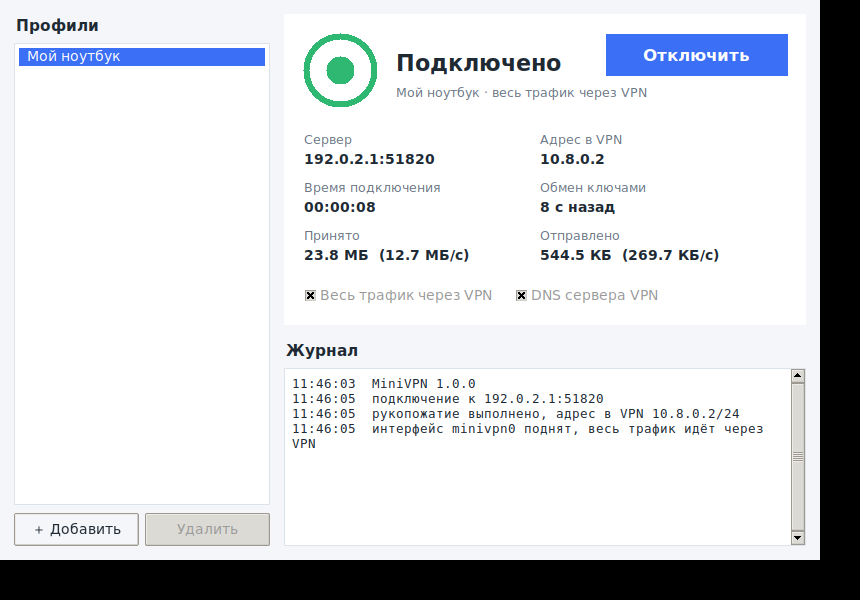

# MiniVPN — собственный VPN: сервер + клиент с графическим интерфейсом

Полностью рабочий VPN на Python: свой сервер, который ставится на любой Linux-VPS,
и клиент с графическим интерфейсом для Windows и Linux. Весь трафик устройства
(или только сеть VPN — на выбор) идёт через зашифрованный UDP-туннель, сервер выпускает
его в интернет через NAT.

```
 ┌────────────── клиент ──────────────┐        UDP 51820         ┌──────────── сервер (Linux) ────────────┐
 │ приложения → TUN minivpn0/MiniVPN  │  ══ ChaCha20-Poly1305 ══ │ TUN minivpn0 10.8.0.1 → NAT → интернет │
 │ GUI (Tkinter) · маршруты · DNS     │     Noise IK, X25519     │ клиенты по ключам, iptables MASQUERADE │
 └────────────────────────────────────┘                          └────────────────────────────────────────┘
```

## Возможности

- **Своя криптография на проверенных примитивах**: рукопожатие `Noise_IK_25519_ChaChaPoly_BLAKE2s`
  (та же схема, что у WireGuard), взаимная аутентификация по ключам X25519, прямая секретность (PFS),
  шифрование пакетов ChaCha20-Poly1305, защита от повторов (скользящее окно 2048 пакетов
  и метка времени в рукопожатии), смена ключей каждые 10 минут.
- **Сервер**: несколько клиентов, у каждого свой ключ и постоянный адрес в VPN; NAT и форвардинг
  настраиваются и убираются автоматически; добавление/удаление/блокировка клиента без перезапуска;
  защита от подмены адреса (клиент может слать пакеты только со своего IP); роуминг клиента
  (смена Wi-Fi ↔ мобильная сеть); systemd-служба и скрипт установки.
- **Клиент с GUI**: профили (строка `minivpn://…` или файл `.mvpn`), кнопка подключения,
  индикатор состояния, адрес в VPN, время подключения, трафик и скорость, журнал;
  режим «весь трафик через VPN» или только сеть VPN; DNS сервера VPN; блокировка утечек IPv6
  (Linux); автопереподключение при обрыве связи или перезапуске сервера; корректное восстановление
  маршрутов и DNS при отключении.
- **Консольный клиент** для серверов и скриптов.

## Быстрый старт

### 1. Сервер (Linux VPS, root)

Нужны Python 3.8+, `python3-cryptography`, `iproute2`, `iptables` и доступ к `/dev/net/tun`.

```bash
git clone https://github.com/Karim2005bobo/my_vpn && cd my_vpn
sudo bash deploy/install_server.sh              # или: sudo bash deploy/install_server.sh vpn.example.com
```

Скрипт поставит зависимости, скопирует код в `/opt/minivpn`, создаст ключ и конфиг
`/etc/minivpn/server.json`, запустит службу `minivpn-server` и откроет UDP 51820 в ufw/firewalld.
Если у хостинга есть свой файрвол в панели — откройте там **UDP 51820**.

Добавьте клиента — команда выведет строку подключения и сохранит её в `/etc/minivpn/clients/<имя>.mvpn`:

```bash
sudo minivpn-server add-client laptop
# Клиент laptop добавлен, адрес в VPN: 10.8.0.2
# minivpn://eyJ2IjoxLCJuYW1lIjoibGFwdG9wIiwiaG9zdCI6...
```

Строка содержит закрытый ключ клиента — передавайте её только владельцу устройства.
На каждое устройство — свой клиент.

### 2. Клиент с графическим интерфейсом

**Windows 10/11**

1. Установите Python 3.8+ с python.org (галочка «Add python.exe to PATH»; Tkinter входит в установщик).
2. Скачайте драйвер Wintun: <https://www.wintun.net> → из архива возьмите `wintun/bin/amd64/wintun.dll`
   (для ARM64 — `arm64`) и положите рядом с `MiniVPN.bat` (в корень репозитория).
3. Запустите `MiniVPN.bat` (первый раз он установит `cryptography`).
4. «＋ Добавить» → вставьте строку `minivpn://…` (или «Из файла…» → `.mvpn`) → «Подключить».
   Приложение запросит права администратора (UAC) — они нужны для создания сетевого адаптера.

**Linux**

```bash
sudo apt install python3-tk python3-cryptography iproute2     # Fedora: python3-tkinter
cd my_vpn && ./minivpn-gui.sh          # запросит sudo; либо GUI сам предложит перезапуск через pkexec
```

Профили хранятся в `~/.config/minivpn/profiles.json` (Windows: `%APPDATA%\MiniVPN`), права 600.



### 3. Консольный клиент

```bash
sudo PYTHONPATH=. python3 -m minivpn.client connect laptop.mvpn     # или minivpn://..., или имя профиля
sudo PYTHONPATH=. python3 -m minivpn.client connect laptop.mvpn --split   # только сеть 10.8.0.0/24
```

Ctrl+C — отключиться (маршруты и DNS восстанавливаются).

## Управление сервером

| Команда | Что делает |
|---|---|
| `minivpn-server init --host <IP/домен> [--port 51820] [--network 10.8.0.0/24] [--dns 1.1.1.1 8.8.8.8]` | создать ключи и конфиг |
| `minivpn-server add-client <имя> [--ip 10.8.0.50]` | добавить клиента, выдать строку подключения |
| `minivpn-server list` | клиенты: адрес, онлайн/офлайн, откуда подключены, трафик |
| `minivpn-server show-client <имя>` | снова показать строку подключения |
| `minivpn-server disable-client <имя>` / `enable-client` | заблокировать / разблокировать |
| `minivpn-server remove-client <имя>` | удалить клиента |
| `minivpn-server run [-v]` | запустить сервер на переднем плане (служба делает это сама) |

Изменения клиентов работающий сервер подхватывает сам (следит за файлом конфига, также по `SIGHUP`).
Журнал: `journalctl -u minivpn-server -f`. Другой путь к конфигу: `-c /path/server.json`.

Пример `/etc/minivpn/server.json`:

```json
{
  "public_host": "203.0.113.10", "listen": "0.0.0.0", "port": 51820,
  "private_key": "…", "network": "10.8.0.0/24", "address": "10.8.0.1",
  "dns": ["1.1.1.1", "8.8.8.8"], "mtu": 1400, "tun": "minivpn0",
  "nat": true, "wan": null,
  "clients": [{"name": "laptop", "public_key": "…", "ip": "10.8.0.2", "enabled": true}]
}
```

`wan` — внешний интерфейс для NAT (`null` — интерфейс маршрута по умолчанию), `nat: false` —
без выхода в интернет (только связь клиентов с сервером и между собой).

## Протокол

Транспорт — UDP. Все поля заголовка входят в AAD, т.е. защищены от подмены.

| Сообщение | Формат |
|---|---|
| `INIT` (клиент → сервер) | `1` · индекс отправителя · `e` · `enc(s_клиента)` · `enc(метка времени)` |
| `RESP` (сервер → клиент) | `2` · индекс отправителя · индекс получателя · `e` · `enc({ip, prefix, dns, mtu})` |
| `DATA` | `3` · индекс получателя · счётчик u64 · `ChaCha20-Poly1305(вид ‖ IP-пакет)` |

Рукопожатие Noise IK: `-> e, es, s, ss` / `<- e, ee, se`. Клиент заранее знает открытый ключ сервера
(из строки подключения), поэтому подменить сервер нельзя; сервер пускает только ключи из своего
списка. Сервер переключается на новые ключи только после первого пакета клиента в новой сессии,
поэтому перехваченный и повторённый `INIT` ничего не ломает. Нонс — счётчик пакета, окно повторов —
2048 пакетов. Клиент шлёт keepalive каждые 15 с простоя (сервер отвечает эхом), при отсутствии ответа
~10 с выполняет новое рукопожатие, через 45 с тишины показывает «Восстановление связи…».

## Структура

```
my_vpn/
├── minivpn/
│   ├── crypto.py      ключи X25519, Noise IK, транспортные ключи, окно повторов
│   ├── protocol.py    формат пакетов, таймеры, строка подключения minivpn://
│   ├── tun.py         TUN: Linux /dev/net/tun, Windows Wintun (ctypes)
│   ├── netconfig.py   адреса, маршруты, DNS, NAT (ip/iptables, netsh/route)
│   ├── server.py      сервер + CLI управления клиентами
│   ├── client.py      ядро клиента (потоки, keepalive, rekey, переподключение) + CLI
│   ├── profiles.py    хранение профилей
│   └── gui.py         графический клиент (Tkinter)
├── deploy/            install_server.sh, minivpn-server.service
├── tests/             test_crypto.py (unit), e2e_netns.sh (сквозной тест)
├── MiniVPN.bat        запуск GUI в Windows
└── minivpn-gui.sh     запуск GUI в Linux
```

## Тесты

```bash
python3 -m unittest discover -s tests          # криптография и формат профилей
sudo bash tests/e2e_netns.sh                   # сквозной тест в сетевых пространствах Linux
```

`e2e_netns.sh` поднимает три изолированных сетевых пространства (клиент — сервер — «интернет»),
запускает настоящий сервер и клиент и проверяет: ping через туннель, выход в «интернет» только через
VPN+NAT, переключение DNS и маршрута по умолчанию, скачивание 20 МБ с проверкой SHA-256
(~100 Мбит/с), смену ключей, `server list`, автопереподключение после перезапуска сервера,
отказ чужому ключу, полное восстановление сети клиента и снятие правил iptables на сервере.

## Ограничения

- Внутри туннеля — IPv4 (глобальный IPv6 на Linux-клиенте при полном туннеле блокируется,
  чтобы не было утечек). Подключаться к серверу можно по IPv4.
- Клиент — Windows и Linux; macOS не поддерживается. Сервер — только Linux.
- Реализация на чистом Python: ~100 Мбит/с на ядро — достаточно для личного/семейного VPN,
  но это не замена WireGuard для высоких нагрузок.
- Нет защиты от DoS рукопожатиями (cookie-механизма WireGuard) и kill switch.
